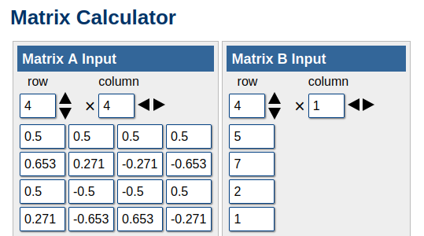
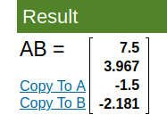
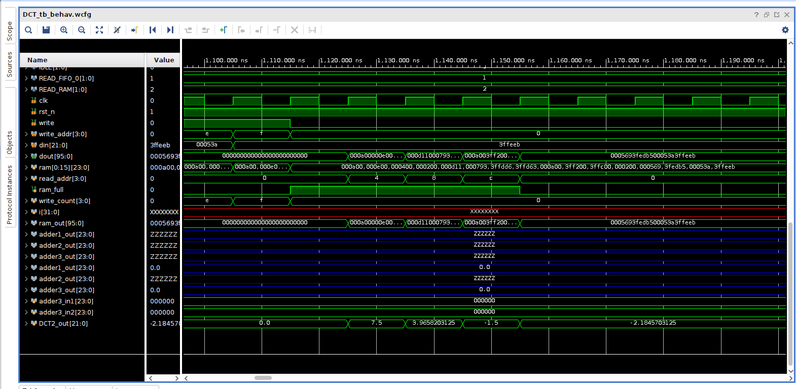
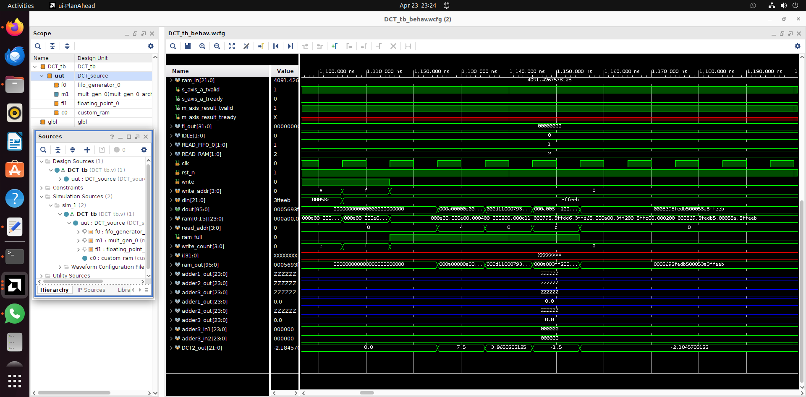

# 1D DCT Transform – Verilog Implementation

This folder contains the complete implementation of a 1D Discrete Cosine Transform (DCT) using Verilog. It includes:

-  Source files
-  Testbench
-  IP core configuration files (`.xci`)
-  Simulation results (waveforms)

---

##  Project Workflow Overview

The project takes a 4×4 block of 8-bit input data and performs a 1D DCT transformation row-wise. Here's how the data flows through the design:

1. **FIFO Buffering**  
   The input data is first fed into an 8-bit wide, 16-depth FIFO buffer. This helps manage the input timing and ensures data is stored sequentially before further processing.

2. **Multiplier Block**  
   Once the FIFO is filled, the data is passed to a multiplier block that performs element-wise multiplication of the input data with the corresponding DCT coefficient matrix. This step forms the core of the transformation logic.

3. **Custom RAM for Intermediate Storage**  
   The multiplied outputs are stored in a custom RAM block that is 96 bits wide. Each 96-bit RAM entry holds the intermediate values for one transformation row.

4. **Final Output Generation**  
   Each 96-bit RAM output is divided into four 24-bit segments. These segments are then added appropriately to compute the final 4×1 1D DCT output vector.

5. **Result**  
   This process is repeated for four rows, ultimately generating a complete 4×1 matrix representing the 1D DCT-transformed data.

---

# Simulation Results

Below is the DCT coefficient matrix (A) and inout matrix (B).

And here is the actual multiplied output it should generate. 

Below is the simulated waveform results, providing the same outputs as intended thus verifying the transform logic. 

Do check the test_results folder for another case with input array as 1 2 3 4 this time. 

Heres the full waveform screenshot along with all the source files and the ips/custom files that were used to simulate the design.

##  Notes

- The `.xci` files in `ip_files/` are sufficient to regenerate the required IP cores in Vivado.
- Simulation results confirm the correctness of the DCT logic and flow.

---

Feel free to clone and simulate using Vivado to explore or modify the design!

