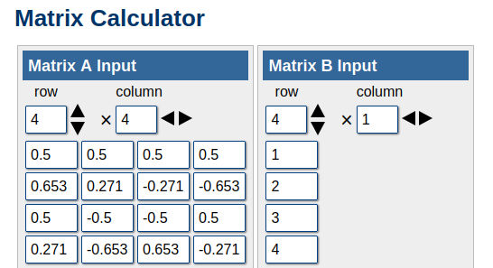
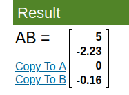
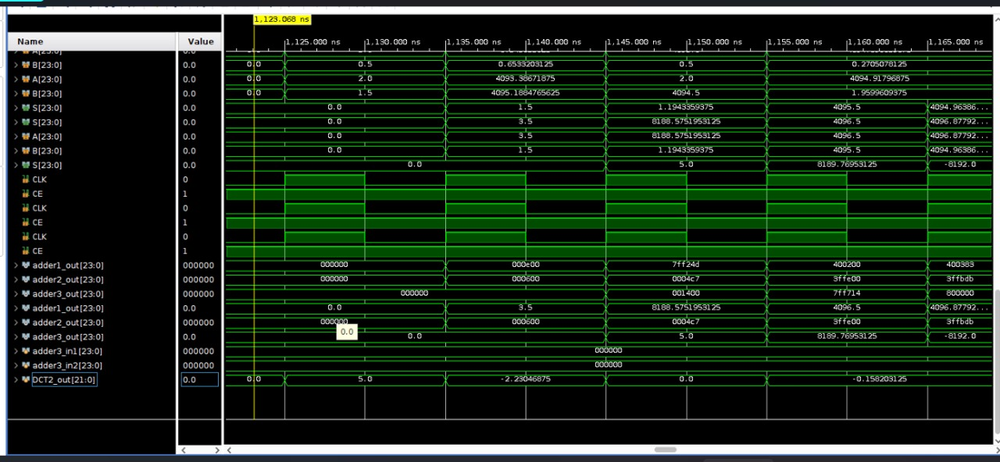
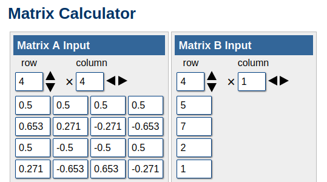
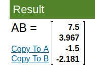
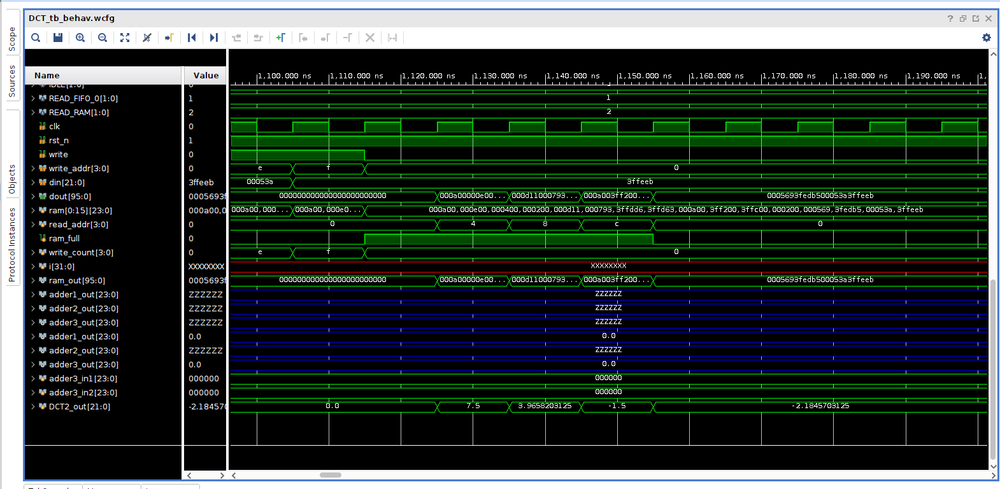

# Simulation Results

FOR INPUTS 1234 AS 4X1 ARRAY  
Below is the DCT coefficient matrix (A) and inout matrix (B).

And here is the actual multiplied output it should generate. 

Below is the simulated waveform results, providing the same outputs as intended thus verifying the transform logic. 

Output elements through DCT2_out [21:0] register.

FOR INPUTS 5721 AS 4X1 ARRAY  
Below is the DCT coefficient matrix (A) and inout matrix (B).

And here is the actual multiplied output it should generate. 

Below is the simulated waveform results, providing the same outputs as intended thus verifying the transform logic. 

Output elements through DCT2_out [21:0] register.

