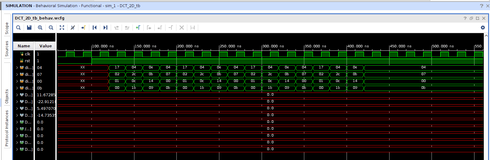
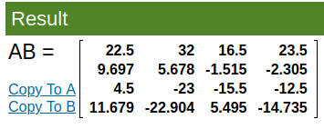
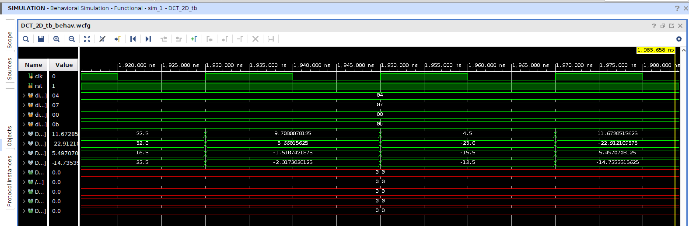
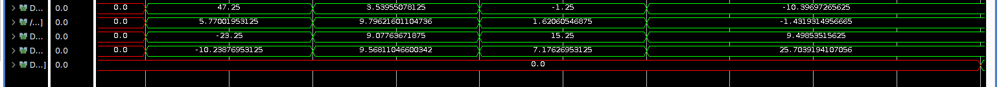

## Simulation Results for test Case 2 

Below are the simulation outputs generated for the 2D DCT Transform:

### C and X Matrix used 

### Input Data Waveform

### Intermediate CX Matrix (After First Stage)

### Intermediate CX Matrix Waveform 

###  (CX)^T * C Matrices 

T_23210.png)

### Final 2D DCT Transformed Matrix (After Second Stage)

T_23210_result.png)

### Final 2D DCT Transformed Matrix Waveform ( Parallel )

### Final 2D DCT Transformed Matrix Waveform ( Serial )

## Do check the another Test case here : 

