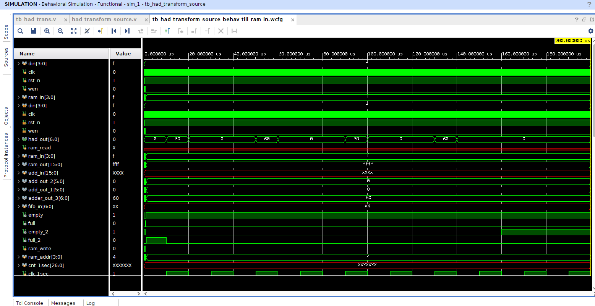
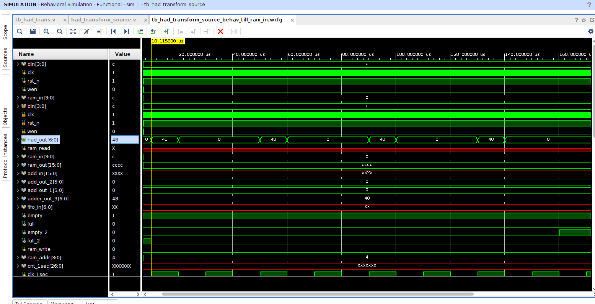

# Project Overview: 4x4 Hadamard Transform in Verilog
This folder contains the main source file of the project, which implements the complete Hadamard transform logic using Verilog HDL, along with the testbench used to simulate and verify the results.

# Workflow Description
The Hadamard transform is performed over a 4×4 matrix (16 elements in total), processed in a structured pipeline involving FIFO buffering, RAM storage, and parallel adder logic. Below is the high-level flow of the design:

    1. Input FIFO Buffering:

        An 8-bit FIFO is used as the primary buffer.

        It can store 16 elements of 8 bits each.

        Data is continuously pushed into the FIFO until it is full.

    2. Data Transfer to RAM:

        Once the FIFO is full, its contents are transferred to a RAM block.

        The RAM accepts one 8-bit element per clock cycle.

        After receiving 4 elements (in 4 clock cycles), the RAM flushes out a valid 32-bit output combining the 4 stored values.

    3. Parallel Feeding into Adder Logic:

        The 32-bit output from RAM (containing 4 parallel 8-bit elements) is provided to the adder logic block.

        This parallelism is critical, as the Hadamard transform's core computation requires simultaneous processing of 4 elements.

    4. Adder Logic Execution:

        The adder logic processes the 4 input elements per clock cycle.

        This step continues for 4 clock cycles, ensuring all 16 input elements are processed.

        As a result, the logic outputs the entire 4x4 Hadamard transformed matrix, one row at a time.

# Key Highlights

    Designed using modular Verilog HDL.

    Simulated using a comprehensive testbench to verify functional correctness.

    Efficient use of FIFO and RAM to manage sequential-to-parallel data transformation.

    Optimized for hardware implementation with pipeline-ready architecture.
    

  # Flow Diagram

   | Input Data (Serial) | ----> | FIFO 8-bit 16-depth | ----> | RAM 4x8-bit RAM | ----> |   Adder Logic (to 32-bit) 4x4 Hadamard Transform Core | ----> | Custom fifo (8x16) for Output Storage |
    

  # How to Simulate

To run the simulation and verify the Hadamard transform logic:

    Open the project in Vivado.

    Make sure the IP cores are generated (see below).

    Set the testbench (*.v or *.sv) as the top module for simulation.

    Run the behavioral simulation.

    Observe waveform outputs or use display statements to confirm correct transformation.

# IP Regeneration Instructions

If you cloned this repository, the IPs may not be generated yet. Here's how to restore them:

    Open the .xpr project file in Vivado.

    Navigate to the "IP Sources" panel.

    Right-click on each IP core and select:

         1. "Generate Output Products"

         2. (Optional) "Generate Simulation Sources" if you plan to simulate IPs

    Wait for Vivado to complete the generation process.

or else just generate the Ips which are used in the source code directly from the ip catalog provided inside vivado, also do note theres a custom fifo file used in the code to store the final outputs of the transformed matrix which can later be used to generate the transformed matrix outputs by using this file itself as a new ip in any other application or code.

# Simulation Results

After simulating the design, the following waveform confirms the correct execution of the 4x4 Hadamard transform:

1. When the input array is all 15 in decimal system 16 times, after being processed by the transform logic should provide a answer as 60 0 0 0 , followed by the same pattern 3 more times 

2. Similarly when input is all 12 , the output is 48 0 0 0...

    
   
