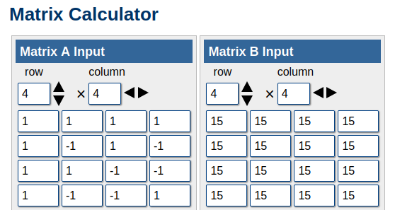
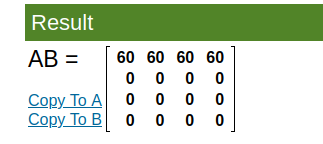
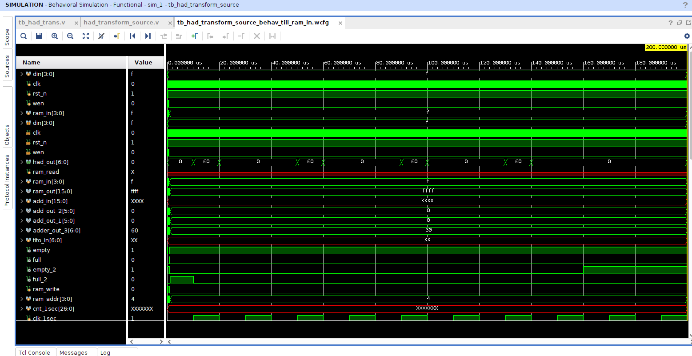
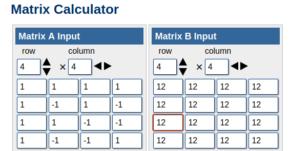
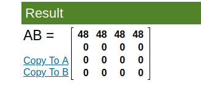
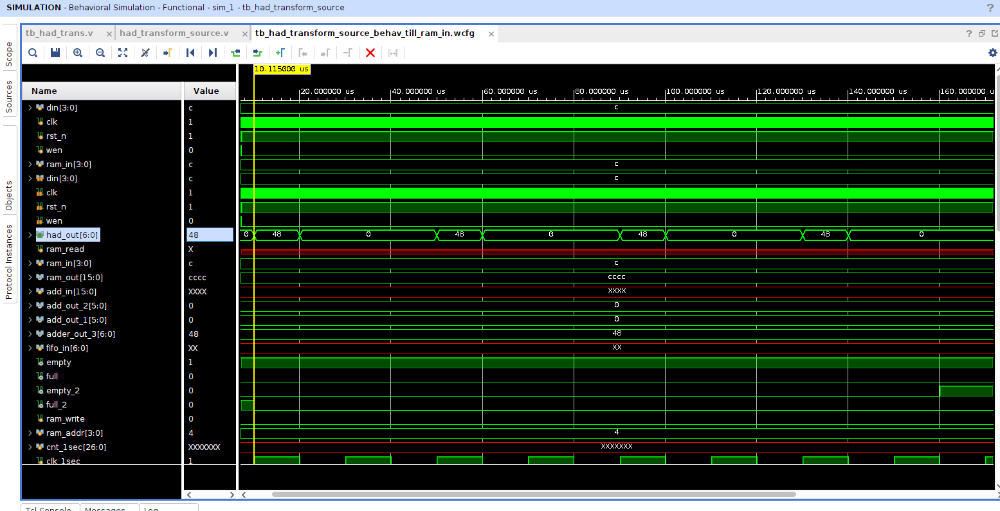

## Simulation Results

Below are the simulation outputs generated for the 2D DCT Transform:

### Hadamrd matrix and input_01 matrix 

### Hadamard Transformed Matrix 

### Hadamard Transformed Matrix Waveform (Check had_out[8:0]) 

### Hadamrd matrix and input_02 matrix 

### Hadamard Transformed Matrix 

### Hadamard Transformed Matrix Waveform  (Check had_out[8:0]) 

## For more details and how all this works go to : [Full details->](/README.md)
